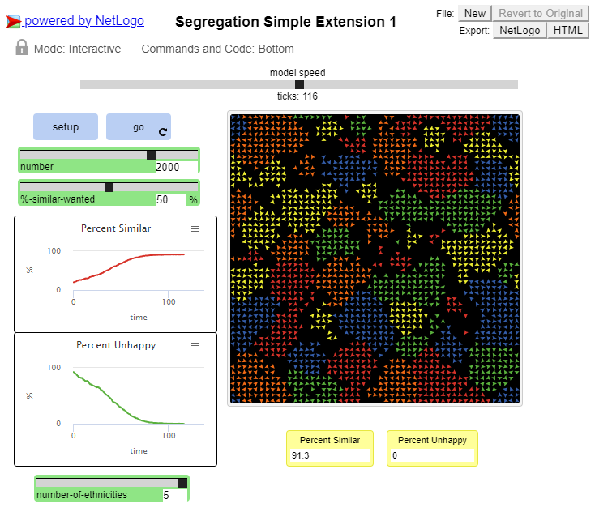
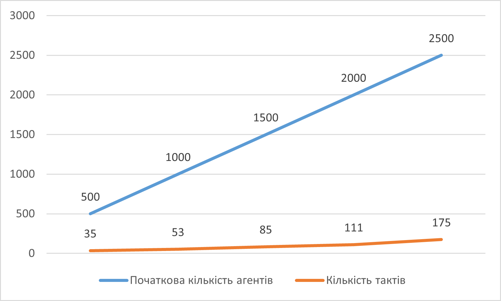
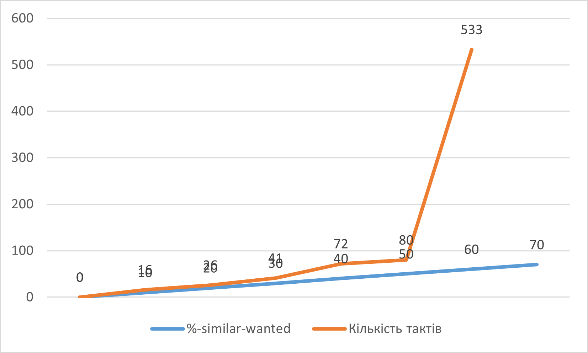
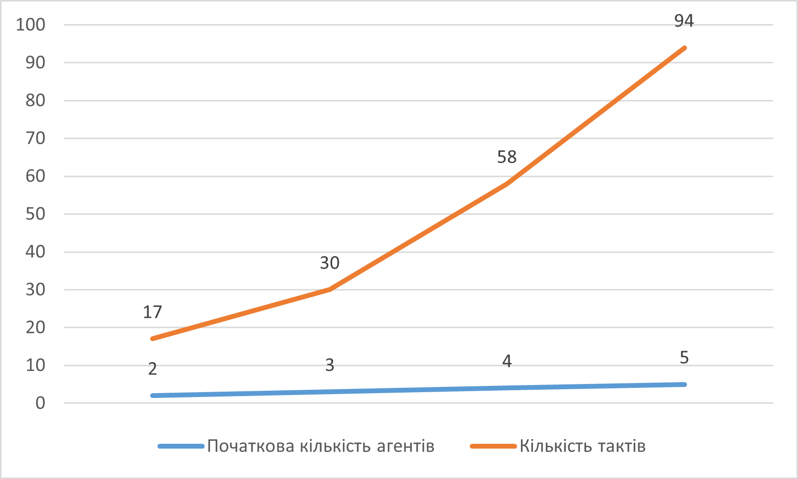

## Комп'ютерні системи імітаційного моделювання
## СПм-22-4, **Хрустальов Євгеній Кирилович**
### Лабораторна робота №**1**. Опис імітаційних моделей та проведення обчислювальних експериментів

 

### Варіант 8, модель у середовищі NetLogo: Segregation Simple Extension 1. Модель досліджує прагнення "групуватися" із "своїми" і толерантність до чужаків.
[Segregation Simple Extension 1](http://www.netlogoweb.org/launch#http://www.netlogoweb.org/assets/modelslib/IABM%20Textbook/chapter%203/Segregation%20Extensions/Segregation%20Simple%20Extension%201.nlogo)

 

### Вербальний опис моделі:
Цей проект моделює поведінку черепах(*turtles*, не буквально) різних етнічних груп у міфічному ставку. Всі черепахи ладнають між собою. Але кожна черепаха хоче переконатися, що вона живе біля якогось «свого». Симуляція показує, як ці індивідуальні переваги впливають на ставку, що призводить до великомасштабних моделей.
Цей проект був натхненний працями Томаса Шеллінга про соціальні системи (зокрема, щодо сегрегації житла в містах).
Ця модель є розширенням моделі Segregation Simple. Це дозволяє налаштувати більше ніж 2 етнічні групи агентів.

### Керуючі параметри:
- **number** керує загальною кількістю черепах. (Вона вступає в дію, коли ви наступного разу натискаєте **setup**.)
- **number-of-ethnicities** контролює кількість різних типів черепах, кожна різного кольору.
- **%-similar-wanted** контролює відсоток одноколірних черепах, яких кожна черепаха хоче мати серед своїх сусідів.

### Внутрішні параметри:
- **happy?** - для кожної черепахи вказує, чи принаймні %-similar-wanted відсоток сусідів цієї черепахи такого ж кольору, як черепаха.
- **similar-nearby** - скільки сусідніх ділянок мають черепаху мого кольору?
- **total-nearby** - скільки сусідніх ділянок має черепаха?

### Показники роботи системи:
**percent similar** - показує середній відсоток сусідів одного кольору для кожної черепахи. Він починається приблизно з 0,5, оскільки кожна черепаха починає (в середньому) з рівною кількістю червоних і зелених черепах як сусідів.
**percent nehashy** - показує відсоток черепах, які мають менше сусідів з однієї етнічної приналежності, ніж вони хочуть (і тому хочуть переїхати).

### Примітки:
- Згодом кількість нещасних черепах зменшується. Але ставок стає більш відокремленим, з кластерами кожної етнічної групи.
- Зазвичай симуляція триває +/- 30 тактів.

### Недоліки моделі:
- Відсутність бажання бачити іншу етнічну групу поблизу.
- Відсутність прив'язаності до того, з ким з'явився.
- Відсутність ворожості по відношенню до іншої етнічної групи.

Скріншот моделі під час роботи:

 

## Обчислювальні експерименти
### 1. Вплив початкової кількості "черепах" на швидкість упорядковування системи.
Досліджується залежність кількості тактів від **number**.
Експерименти проводяться при таких керуючих параметрах:
- **number-of-ethnicities** 5
- **%-similar-wanted** 50%

<table>
<thead>
<tr><th>Початкова кількість агентів</th><th>Кількість тактів</th></tr>
</thead>
<tbody>
<tr><td>500</td><td>35</td></tr>
<tr><td>1000</td><td>53</td></tr>
<tr><td>1500</td><td>85</td></tr>
<tr><td>2000</td><td>111</td></tr>
<tr><td>2500</td><td>175</td></tr>
</tbody>
</table>

### 2. Вплив відсотку одноколірних черепах, яких кожна черепаха хоче мати серед своїх сусідів на швидкість завершення симуляції
Досліджується залежність кількості тактів від **%-similar-wanted**.
Експерименти проводяться при таких керуючих параметрах:
- **number-of-ethnicities** 5
- **number** 1500

<table>
<thead>
<tr><th>%-similar-wanted</th><th>Кількість тактів</th></tr>
</thead>
<tbody>
<tr><td>0</td><td>0</td></tr>
<tr><td>10</td><td>16</td></tr>
<tr><td>20</td><td>26</td></tr>
<tr><td>30</td><td>41</td></tr>
<tr><td>40</td><td>72</td></tr>
<tr><td>50</td><td>80</td></tr>
<tr><td>60</td><td>533</td></tr>
<tr><td>70</td><td>-</td></tr>
</tbody>
</table>

Після встановлення значення відсотку одноколірних черепах, яких кожна черепаха хоче мати серед своїх сусідів 70 та вище симуляція тривала більше 3000 тактів та не було помічено жодного кластеру або відокремлення якоїсь групи *черепах*. У зв'язку з цим експеримент було зупинено.

### 3. Вплив різноманітності *черепах* на швидкість упорядковування системи.
Досліджується залежність кількості тактів від **number-of-ethnicities**.
Експерименти проводяться при таких керуючих параметрах:
- **number** 1500
- **%-similar-wanted** 50%

<table>
<thead>
<tr><th>Початкова кількість агентів</th><th>Кількість тактів</th></tr>
</thead>
<tbody>
<tr><td>2</td><td>17</td></tr>
<tr><td>3</td><td>30</td></tr>
<tr><td>4</td><td>58</td></tr>
<tr><td>5</td><td>94</td></tr>
</tbody>
</table>

