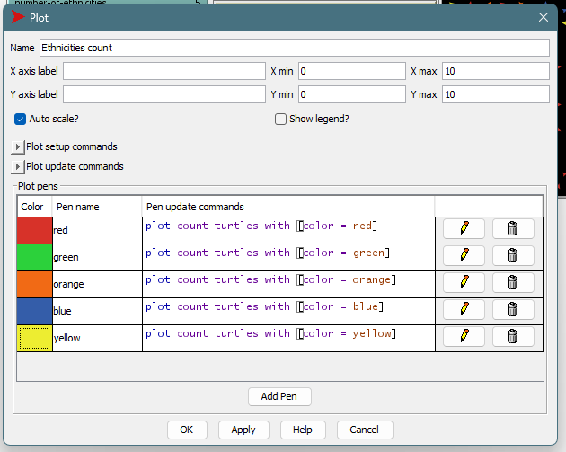

## Комп'ютерні системи імітаційного моделювання
## СПм-22-11, **Хрустальов Євгеній Кирилович**
### Лабораторна робота №**2**. Редагування імітаційних моделей у середовищі NetLogo

 

### Варіант 8, модель у середовищі NetLogo: Segregation Simple Extension 1. Модель досліджує прагнення "групуватися" із "своїми" і толерантність до чужаків.
[Segregation Simple Extension 1](http://www.netlogoweb.org/launch#http://www.netlogoweb.org/assets/modelslib/IABM%20Textbook/chapter%203/Segregation%20Extensions/Segregation%20Simple%20Extension%201.nlogo)

Додати можливість агенту зникнути, вірогідність чого залежить від кількості наявних поряд з ним "чужих" і кількості представників їхньої групи у їх власному оточенні. Виводити графік зміни розміру популяції.

 

### Внесені зміни у вихідну логіку моделі, за варіантом:

Для визначення *кількості наявних поряд з ним "чужих" і кількості представників їхньої групи у їх власному оточенні* було написано процедуру **Prots**:
<pre>
to-report Prots [var1 var2]
  ifelse var2 != 0 [
    report (var1 / var2) * 100
  ] [
    report 0
  ]
end
</pre>
Та додано її використання у процедуру **update-turtles**:
<pre>
let unsimilar-nearby total-nearby - similar-nearby   ;; Кількість "чужих" сусідів
let %-similar Prots similar-nearby total-nearby      ;; Обчислення відсотку "своїх" сусідів
let %-unsimilar Prots unsimilar-nearby total-nearby  ;; Обчислення відсотку "чужих" сусідів
</pre>
Тепер є можливість обчислення черепахами відсотків *своїх* та *чужих*. Використовувати отримані значення буду таким чином:
Створив нову змінну **turtles-own**:
<pre>
lonely?
</pre>
та використав у тій же процедурі **update-turtles**:
<pre>
set lonely? %-similar < %-unsimilar
</pre>
Тепер, коли є значення, що виявляє наявність переваги кількості чужих агентів - створив процедуру **lonely-disappear** для "зникання" оточених агентів:
<pre>
to lonely-disappear
  ask turtles with [ lonely? ] [
    if random 100 > 50 [ die ]
  ]
end
</pre>
Після цього додав графік, що відображає кількість черепах по кольорам та на цьому внесені зміни за варіантом були завершені:

 

### Внесені зміни у вихідну логіку моделі, на власний розсуд:
Створив слайдер **friendly** для визначення вірогідності "зникання" черепахи по принципу - чим більше значення **friendly** тим менше черепах буде "зникати":

<pre>
to lonely-disappear
  ask turtles with [ lonely? ] [
    if random 101 > 0 + friendly [ die ]
  ]
end
</pre>
Додав підрахунок загальної кількості черепах:

Додав дві нові етнічності:

<pre>
to setup
...
  set colors [ red green yellow blue orange violet white ]
...
</pre>

Загалом після змін модель виглядає так:

 

## Обчислювальні експерименти
### 1. Вплив показнику дружності на кількість залишившихся черепах наприкінці симуляції
Досліджується вплив **friendly** на показник **count turtles** за таких значеннях керуючих параметрів:
- **number** 2000
- **%-similar-wanted** 50
- **number-of-ethnicities** 7

<table>
<thead>
<tr><th>Дружність</th><th>Кількість залишившихся черепах</th></tr>
</thead>
<tbody>
<tr><td>0</td><td>75 черепах після усього 2 тактів</td></tr>
<tr><td>10</td><td>176 черепах після усього 3 тактів</td></tr>
<tr><td>20</td><td>211 черепах після усього 4 тактів</td></tr>
<tr><td>30</td><td>257 черепах після усього 6 тактів</td></tr>
<tr><td>50</td><td>311, 14 тактів</td></tr>
<tr><td>75</td><td>381, 24 такти</td></tr>
<tr><td>100</td><td>2000, 533 такта</td></tr>
</tbody>
</table>

Вигляд симуляції при 0 % дружності:

Вигляд симуляції при 100 % дружності:

