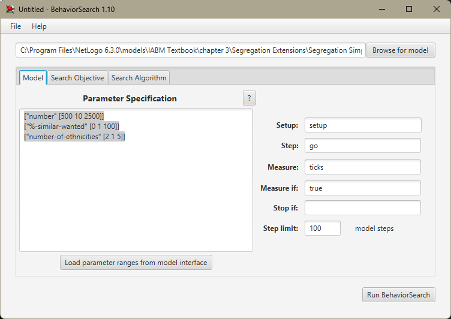
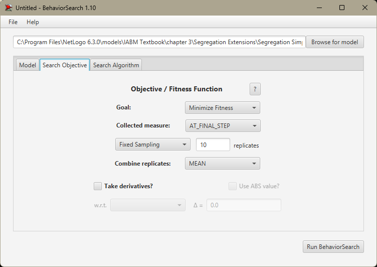
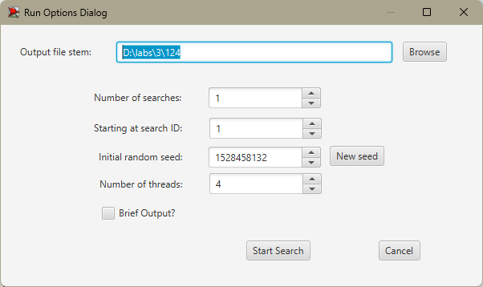
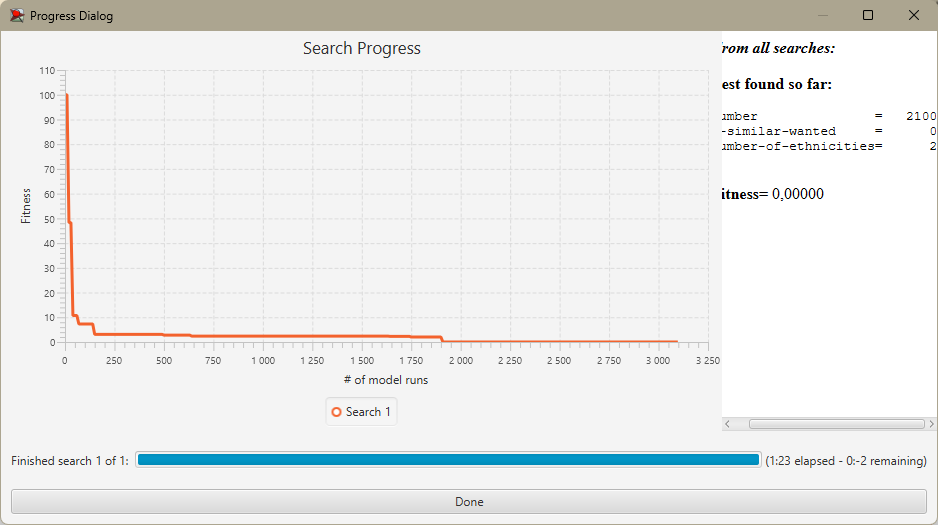
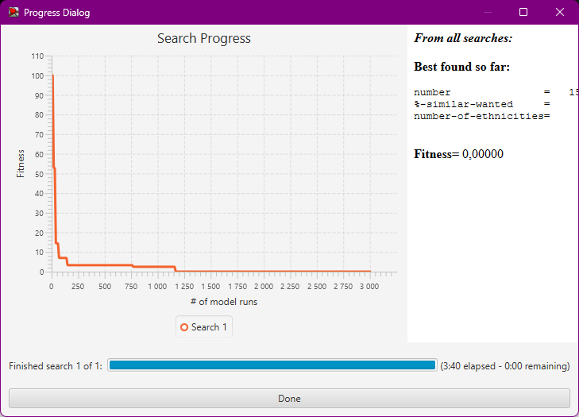

## Комп'ютерні системи імітаційного моделювання
## СПм-22-4, **Хрустальов Євгеній Кирилович**
### Лабораторна робота №**3**. Використання засобів обчислювального интелекту для оптимізації імітаційних моделей

 

### Варіант 8, модель у середовищі NetLogo: Segregation Simple Extension 1. Модель досліджує прагнення "групуватися" із "своїми" і толерантність до чужаків.
[Segregation Simple Extension 1](http://www.netlogoweb.org/launch#http://www.netlogoweb.org/assets/modelslib/IABM%20Textbook/chapter%203/Segregation%20Extensions/Segregation%20Simple%20Extension%201.nlogo)

 

### Вербальний опис моделі:
Цей проект моделює поведінку черепах(*turtles*, не буквально) різних етнічних груп у міфічному ставку. Всі черепахи ладнають між собою. Але кожна черепаха хоче переконатися, що вона живе біля якогось «свого». Симуляція показує, як ці індивідуальні переваги впливають на ставку, що призводить до великомасштабних моделей.
Цей проект був натхненний працями Томаса Шеллінга про соціальні системи (зокрема, щодо сегрегації житла в містах).
Ця модель є розширенням моделі Segregation Simple. Це дозволяє налаштувати більше ніж 2 етнічні групи агентів.

### Керуючі параметри:
- **number** керує загальною кількістю черепах. (Вона вступає в дію, коли ви наступного разу натискаєте **setup**.)
- **number-of-ethnicities** контролює кількість різних типів черепах, кожна різного кольору.
- **%-similar-wanted** контролює відсоток одноколірних черепах, яких кожна черепаха хоче мати серед своїх сусідів.

### Внутрішні параметри:
- **happy?** - для кожної черепахи вказує, чи принаймні %-similar-wanted відсоток сусідів цієї черепахи такого ж кольору, як черепаха.
- **similar-nearby** - скільки сусідніх ділянок мають черепаху мого кольору?
- **total-nearby** - скільки сусідніх ділянок має черепаха?

### Показники роботи системи:
**percent similar** - показує середній відсоток сусідів одного кольору для кожної черепахи. Він починається приблизно з 0,5, оскільки кожна черепаха починає (в середньому) з рівною кількістю червоних і зелених черепах як сусідів.
**percent nehashy** - показує відсоток черепах, які мають менше сусідів з однієї етнічної приналежності, ніж вони хочуть (і тому хочуть переїхати).

 

### Налаштування середовища BehaviorSearch:

**Обрана модель**:
<pre>
C:\Program Files\NetLogo 6.3.0\models\IABM Textbook\chapter 3\Segregation Extensions\Segregation Simple Extension 1.nlogo
</pre>
**Параметри моделі** (вкладка Model):  
<pre>
["number" [500 10 2500]]
["%-similar-wanted" [0 1 100]]
["number-of-ethnicities" [2 1 5]]
</pre>
Використовувана **міра**:  
Для фітнес-функції *(вона ж функція пристосованості або цільова функція)* було обрано **кількість тіків**. Саме кількість тіків буде оприділяти успішність симуляції, адже показник щасливості дуже варіюється, а інші показники не надто доцільні. Вказано у параметрі "**Measure**":
<pre>
ticks
</pre>
Кількість тіків повинна враховуватися **в кінці** симуляції. Параметр зупинки за умовою ("**Stop if**") у разі не використовувався.  
Загальний вигляд вкладки налаштувань параметрів моделі:  

**Налаштування цільової функції** (вкладка Search Objective):  
Метою підбору параметрів імітаційної моделі, що описує дорожній рух двосмуговим шосе, є **мінімізація** – це вказано через параметр "**Goal**" зі значенням **Minimize Fitness**. У параметрі "**Collected measure**", що визначає спосіб обліку значень обраного показника, вказано **AT_FINAL_STEP** щоб брати результат саме по завершені симуляції.  
Щоб уникнути викривлення результатів через випадкові значення, що використовуються в логіці самої імітаційної моделі, **кожна симуляція повторюється по 10 разів**, результуюче значення розраховується як **середнє арифметичне**. 
Загальний вигляд вкладки налаштувань цільової функції:  

**Налаштування алгоритму пошуку** (вкладка Search Algorithm):  
Загальний вид вкладки налаштувань алгоритму пошуку:  

 

### Результати використання BehaviorSearch:
Діалогове вікно запуску пошуку:  
  
Результат пошуку параметрів імітаційної моделі, використовуючи **генетичний алгоритм**:  
  
Результат пошуку параметрів імітаційної моделі, використовуючи **випадковий пошук**:  
  
Під час проведення дослідження у випадку використання **випадкового пошуку** були помічені нестандартні підвищення витрат ресурсів ЕОМ а також на ций метод пішло більше ніж у 2 рази більше часу ніж якби використовували **генетичний алгоритм**.  

І у випадку **генетичного алгоритму** і у випадку **випадкового пошуку** наприкінці пошуку значення керуючих параметрів були такі: **number-of-ethnicities** - 2; **%-similar-wanted** - 0. Що призвело до закінчення симуляції за **0** тактів.
